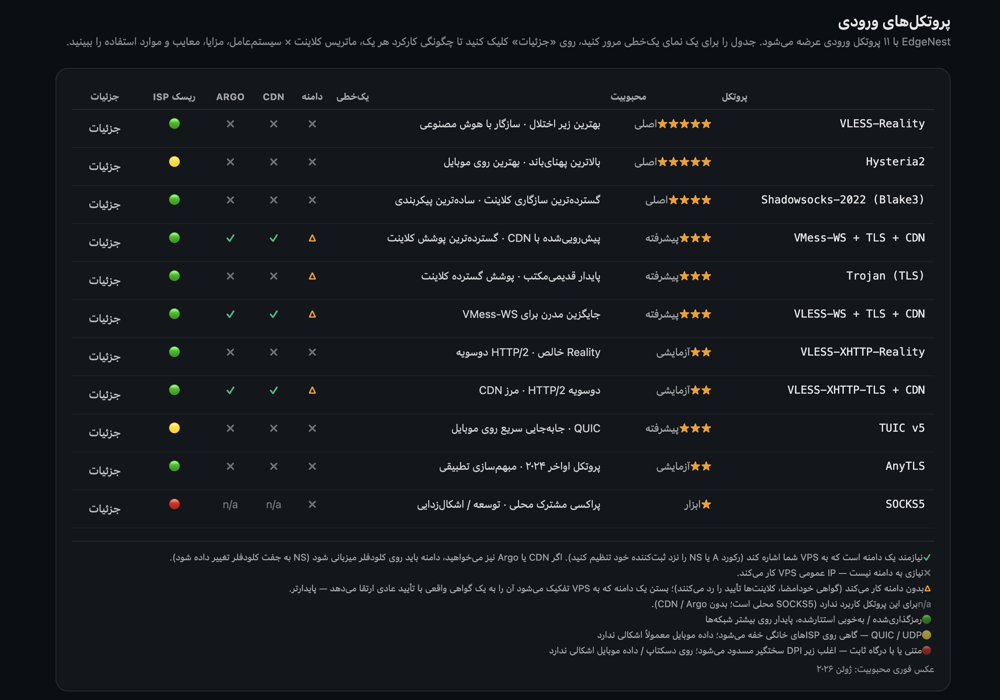
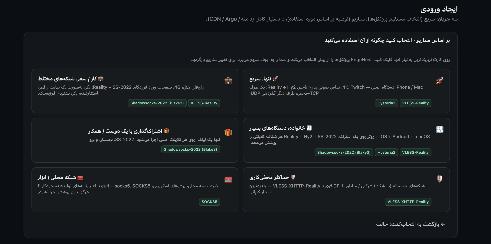
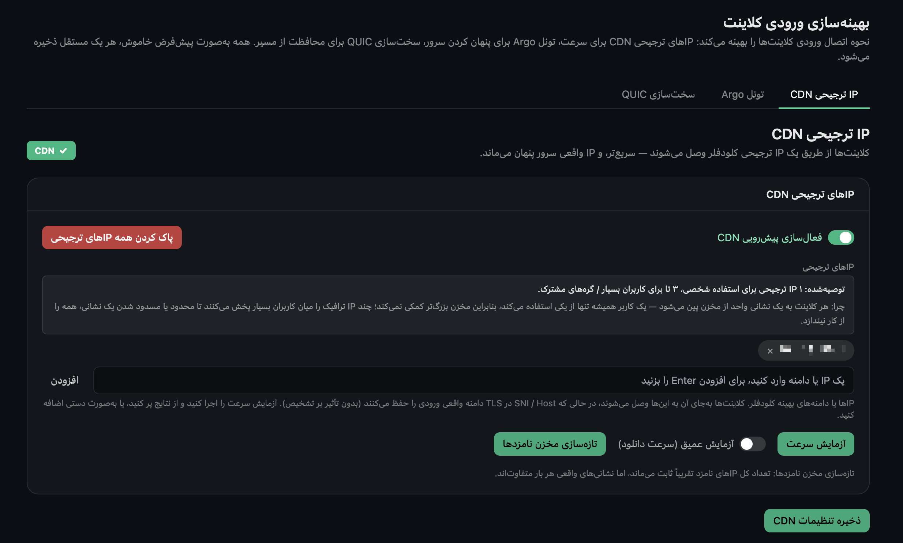
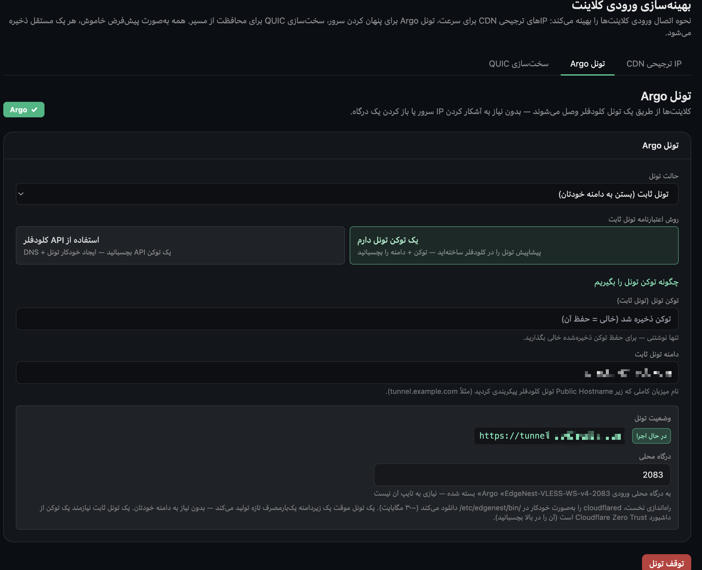

# EdgeNest

**[English](README.md) · [简体中文](README_ZH.md) · [繁體中文](README_ZH-TW.md) · [فارسی](README_FA.md) · [Русский](README_RU.md) · [Tiếng Việt](README_VI.md)**

> پنل مدیریت نود پروکسی خودمیزبان — دو موتوره، مبتنی بر جادوگر (wizard)، استقرار با یک فرمان.

[](./LICENSE)


EdgeNest به کاربران در محیط‌های شبکه‌ای محدود کمک می‌کند تا به‌طور پایدار به ابزارهای هوش مصنوعی، مستندات فنی و منابع آموزشی دسترسی داشته باشند. یک فرمان، پنل، تحویل اشتراک و موتورهای پروکسی را روی VPS خودتان بالا می‌آورد و مدیریت ورودی‌های چندپروتکلی، سهمیه ترافیک، گواهی‌ها و بهینه‌سازی خروجی را در یک‌جا گرد می‌آورد — همه از طریق رابط گرافیکی و بدون ویرایش دستی فایل‌های پیکربندی.

---

## نمای رابط کاربری

_پنل از ۶ زبان پشتیبانی می‌کند — با تغییر زبان README در بالا، تصاویر به همان زبان نمایش داده می‌شوند._

**هر ۱۱ پروتکل ورودی در یک نگاه: محبوبیت، نیاز به دامنه، پشتیبانی CDN / Argo و تاب‌آوری شبکه.**



**کلاینت‌هایی را که استفاده می‌کنید انتخاب کنید — EdgeNest برای هر ورودی پیکربندی آماده‌ی وارد کردن می‌سازد.**



**فرانت CDN اختیاری: کلاینت‌ها از طریق IP ترجیحی Cloudflare سریع‌تر متصل می‌شوند و IP واقعی سرور پنهان می‌ماند.**



**تونل Argo اختیاری: کلاینت‌ها از طریق تونل Cloudflare متصل می‌شوند، بدون نیاز به افشای IP سرور یا باز کردن پورت.**



---

## ویژگی‌ها

**پروتکل‌ها و موتورها**
- **۱۱ پروتکل ورودی** — VLESS-Reality، VLESS-WS، VMess-WS، Trojan-TLS، Hysteria2، TUIC v5، Shadowsocks-2022، AnyTLS، SOCKS5، به‌علاوه VLESS-XHTTP-Reality / VLESS-XHTTP-TLS روی موتور Xray
- **دو موتور به‌عنوان یکی** — sing-box و Xray کنار هم میزبانی می‌شوند، پس یک برنامه دامنه گسترده‌تری از پروتکل‌ها را پوشش می‌دهد
- **ساخت با جادوگر** — مجموعه پروتکل را بر اساس سناریو و کلاینت شما پیشنهاد می‌دهد؛ مناسب تازه‌کارها
- **تنظیم دقیق برای کلاینت‌ها** — برای ۱۳ کلاینت پرکاربرد (Shadowrocket، v2rayN، V2RayNG، Hiddify، Stash، Surge، sing-box، Karing، Mihomo Party، Loon، Quantumult X و غیره) اشتراک‌ها با فرمت اختصاصی هر کلاینت ساخته می‌شوند و هنگام وارد کردن متصل می‌شوند، بدون ویرایش دستی پیکربندی

**کاربران و تحویل**
- **چندکاربره با سهمیه ترافیک** — اعتبارنامه مستقل برای هر کاربر، همراه با سهمیه ترافیک، تاریخ انقضا و بازنشانی
- **تحویل اشتراک** — تولید اشتراک‌هایی که هنگام وارد کردن متصل می‌شوند؛ کد QR و اشتراک‌گذاری با یک ضربه

**دسترسی و بهینه‌سازی خروجی**
- **بهینه‌سازی دسترسی داخلی** — IP ترجیحی CDN، تونل‌های Argo و خروجی WARP، همگی با یک ضربه داخل پنل پیکربندی می‌شوند
- **مسیریابی دسته‌ای با یک کلیک** — ترافیک را بر اساس دسته (هوش مصنوعی، استریم، ابزار توسعه‌دهنده، مسدودسازی تبلیغات و غیره) به WARP / مستقیم / مسدود هدایت کنید
- **بررسی دسترس‌پذیری سرویس‌ها** — با یک ضربه بررسی کنید که آیا نود فعلی به سرویس‌های استریم و هوش مصنوعی مختلف دسترسی دارد
- **مسیریابی از ترافیک واقعی** — دامنه‌هایی را که واقعاً بازدید کرده‌اید به‌صورت لحظه‌ای ضبط کنید و با یک ضربه برای هر کلاینت قوانین مسیریابی بسازید

**عملیات و امنیت**
- **مدیریت گواهی** — گواهی‌های خودامضا بدون تنظیم کار می‌کنند؛ با یک دامنه می‌توانید گواهی Let's Encrypt را از طریق اعتبارسنجی HTTP یا DNS صادر کنید
- **پشته دوگانه IPv4 / IPv6** — ورودی و خروجی دوپشته‌ای؛ نودهای فقط-IPv6 هم درست کار می‌کنند
- **ربات مدیریت تلگرام** — پرس‌وجو، مدیریت و دریافت هشدارها، همه از داخل چت
- **پشتیبان‌گیری و بازیابی** — پایگاه‌داده و گواهی‌ها با هم بسته‌بندی می‌شوند، همراه با پشتیبان‌های رمزگذاری‌شده
- **حریم خصوصی و امنیت** — اعتبارنامه مجزا برای هر کاربر، فایروالی که فقط پورت‌های واقعاً استفاده‌شده را باز می‌کند، Hysteria2 خودامضا که با اثرانگشت گواهی در برابر MITM پین می‌شود، و لاگ‌هایی که می‌توانند IP کلاینت‌ها را پنهان کنند
- **نصب و حذف با یک فرمان** — استقرار با یک فرمان؛ حذف چیزی باقی نمی‌گذارد

---

## شروع سریع

دو روش نصب — هرکدام را که خواستید انتخاب کنید. بلافاصله پس از نصب، اعتبارنامه‌های چاپ‌شده را یادداشت کنید و در اولین ورود رمز عبور را تغییر دهید.

**پیش‌نیازها:** یک VPS لینوکسی ۶۴ بیتی تازه (Debian / Ubuntu و غیره — به «پلتفرم‌های پشتیبانی‌شده» در پایین مراجعه کنید) با دسترسی root، یک مدیر بسته‌ی کارا و اینترنت. نصب‌کننده همه‌ی وابستگی‌های موردنیاز (curl، git، sqlite3، iptables و …) را خودکار نصب می‌کند و باینری‌های از پیش ساخته‌شده را ترجیح می‌دهد — بنابراین یک VPS با **۱ هسته / ۱ گیگابایت (حتی ۵۱۲ مگابایت) بدون هیچ کامپایلی نصب می‌شود**. روی ایمیج‌های بسیار کم‌حجم که حتی `curl` یا `sudo` ندارند، کافی است نصب‌کننده را با کاربر `root` اجرا کنید — خودش هرچه لازم است نصب می‌کند.

### روش A: git clone (توصیه‌شده، آخرین نسخه را دنبال می‌کند)

```bash
# سرورهای تازه بدون git ابتدا به آن نیاز دارند (برای کلون):
#   Debian / Ubuntu:  sudo apt-get update && sudo apt-get install -y git
#   خانواده RHEL:     sudo dnf install -y git
git clone https://github.com/aipo-lenshow/EdgeNest.git
cd EdgeNest
sudo bash scripts/install.sh
```

به‌طور پیش‌فرض نصب‌کننده یک نسخه از پیش ساخته‌شده را از GitHub Release دانلود می‌کند و در نبود آن به ساخت از منبع بازمی‌گردد.

### روش B: نصب از آرشیو Release (بدون git، بدون کامپایل)

آرشیو شامل باینری‌های `edgenest` و `sing-box` است که نصب‌کننده مستقیماً از آن‌ها استفاده می‌کند — هم دانلود و هم کامپایل روی میزبان را رد می‌کند. برای ماشین‌های کم‌حافظه یا توزیع آفلاین مناسب است.

```bash
VER=1.20.0626
ARCH=amd64   # روی ماشین‌های ARM64 از arm64 استفاده کنید
curl -fsSL -O https://github.com/aipo-lenshow/EdgeNest/releases/download/v${VER}/edgenest-${VER}-linux-${ARCH}.tar.gz
tar -xzf edgenest-${VER}-linux-${ARCH}.tar.gz
cd edgenest-${VER}-linux-${ARCH}
sudo bash scripts/install.sh
```

### نصب‌کننده چه می‌کند

1. اجازه می‌دهد زبان پنل را انتخاب کنید، سپس میزبان دسترسی، پورت پنل و افزودن یا نیفزودن موتور Xray را می‌پرسد
2. وابستگی‌های سیستمی را نصب و sing-box (ساخته‌شده با آمار ترافیک) به‌علاوه موتور اختیاری Xray را آماده می‌کند
3. یونیت systemd به نام `edgenest.service` را می‌سازد، فقط پورت‌های واقعاً استفاده‌شده را باز می‌کند و قوانین فایروال را پایدار می‌سازد
4. کنترل ازدحام BBR + fq را فعال می‌کند (`--no-bbr` برای رد کردن)
5. آدرس پنل، نام کاربری اولیه (`EdgeNest`) و یک رمز عبور تصادفی را چاپ می‌کند

برای نصب بدون تعامل از `sudo bash scripts/install.sh --yes` (همه پیش‌فرض‌ها) استفاده کنید؛ برای حذف، `sudo bash scripts/uninstall.sh` را اجرا کنید که کاملاً پاک‌سازی می‌کند و به‌طور پیش‌فرض داده‌های شما را نگه می‌دارد.

### مدیریت از روی سرور

پس از نصب، هر زمان روی سرور دستور **`edgenest`** را اجرا کنید تا یک منوی مدیریت باز شود — مشاهده‌ی آدرس پنل و حساب مدیر، ری‌استارت / توقف / شروع سرویس، مشاهده‌ی لاگ زنده، بازنشانی رمز مدیر، ارتقا به آخرین نسخه پایدار و حذف نصب. اگر آدرس پنل را نشانک نکرده‌اید، سریع‌ترین راه برای یافتن دوباره‌ی آن همین است.

---

## سیستم‌های پشتیبانی‌شده

| دسته | پشتیبانی |
|---|---|
| توزیع‌ها | Debian · Ubuntu · CentOS · AlmaLinux · Rocky · Fedora |
| معماری‌ها | x86_64 (amd64) · ARM64 (aarch64) |
| دسترسی | root |

---

## پروتکل‌های پشتیبانی‌شده

| موتور | پروتکل‌های ورودی |
|---|---|
| sing-box (پیش‌فرض) | VLESS-Reality · VLESS-WS · VMess-WS · Trojan-TLS · Hysteria2 · TUIC v5 · Shadowsocks-2022 · AnyTLS · SOCKS5 |
| Xray (اختیاری) | VLESS-XHTTP-Reality · VLESS-XHTTP-TLS |

هر ورودی پورت، انتقال و منبع گواهی TLS خود را پیکربندی می‌کند (خودامضای داخلی یا صدور خودکار ACME). پروتکل‌های دارای انتقال WebSocket / XHTTP می‌توانند دسترسی CDN و تونل Argo را روی خود بیفزایند. موتور Xray نصب اختیاری است؛ بدون آن پنل فقط پروتکل‌های sing-box را ارائه می‌دهد.

---

## زبان‌های پنل

پنل با ۶ زبان رابط کاربری عرضه می‌شود که هنگام نصب انتخاب و پس از ورود در هر زمان از تنظیمات قابل تغییر است:

English · 简体中文 · 繁體中文 · فارسی (RTL) · Русский · Tiếng Việt

---

## متغیرهای محیطی

`install.sh` متغیرهای محیطی زیر را برای بازنویسی رفتار پیش‌فرض می‌پذیرد (پرچم‌های خط فرمان `--lang=` / `--yes` / `--no-bbr` / `--no-prebuilt` نیز در دسترس‌اند):

| متغیر | پیش‌فرض | کاربرد |
|---|---|---|
| `EDGENEST_LANG` | تشخیص از `$LANG` | زبان پنل و نصب‌کننده (`en` / `zh` / `zh-TW` / `fa` / `ru` / `vi`) |
| `EDGENEST_VERSION` | `1.20.0626` | نسخه‌ای که برای دانلود نسخه از پیش ساخته‌شده استفاده می‌شود |
| `EDGENEST_RELEASE_BASE` | پایه دانلود GitHub Release | آدرس پایه برای نسخه‌های از پیش ساخته‌شده |
| `SINGBOX_VERSION` | `1.13.13` | نسخه sing-box (همیشه با تگ آمار `with_v2ray_api` ساخته می‌شود) |
| `XRAY_VERSION` | `26.3.27` | نسخه Xray (اختیاری) |
| `GO_VERSION` | `1.26.0` | وقتی به ساخت از منبع نیاز است و Go موجود نیست |
| `NODE_MAJOR` | `20` | وقتی به ساخت فرانت‌اند از منبع نیاز است و Node موجود نیست |

---

## ساخت از منبع

```bash
make web      # ساخت فرانت‌اند و جاسازی آن در باینری
make build    # باینری واحد (فرانت‌اند جاسازی‌شده)
./bin/edgenest --role standalone
```

پیش‌نیازهای ساخت: Go 1.26+، Node 20+. `make release` به‌صورت متقابل linux/amd64 + linux/arm64 را کامپایل می‌کند و tar.gz + SHA256SUMS تولید می‌کند. موتور پروکسی sing-box با تگ آمار ترافیک از طریق `scripts/build-singbox.sh` ساخته می‌شود؛ نصب‌کننده در نبود نسخه از پیش ساخته‌شده آن را در همان لحظه می‌سازد.

---

## قدردانی

EdgeNest بر شانه این پروژه‌های متن‌باز عالی ایستاده است:

- [sing-box](https://github.com/SagerNet/sing-box) — موتور پروکسی اصلی
- [Xray-core](https://github.com/XTLS/Xray-core) — موتور اختیاری (VLESS-XHTTP)
- [utls](https://github.com/refraction-networking/utls) — تقلید اثرانگشت TLS
- [wireguard-go](https://github.com/WireGuard/wireguard-go) — پایه خروجی WARP
- [lego](https://github.com/go-acme/lego) — صدور گواهی ACME
- [cloudflared](https://github.com/cloudflare/cloudflared) — تونل‌های Argo

---

## مجوز

[AGPL-3.0](./LICENSE).
