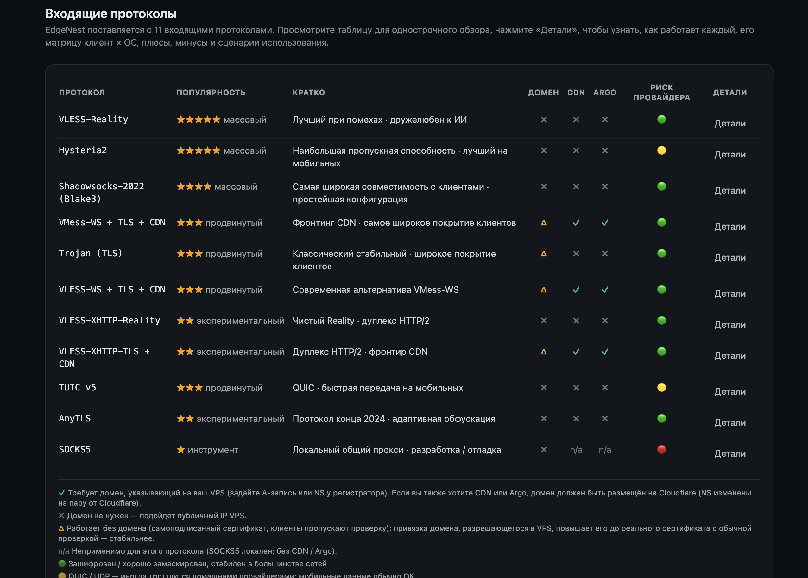
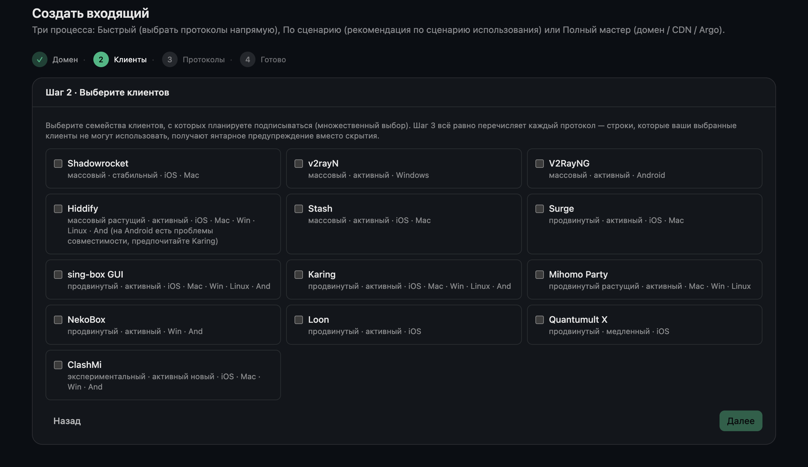
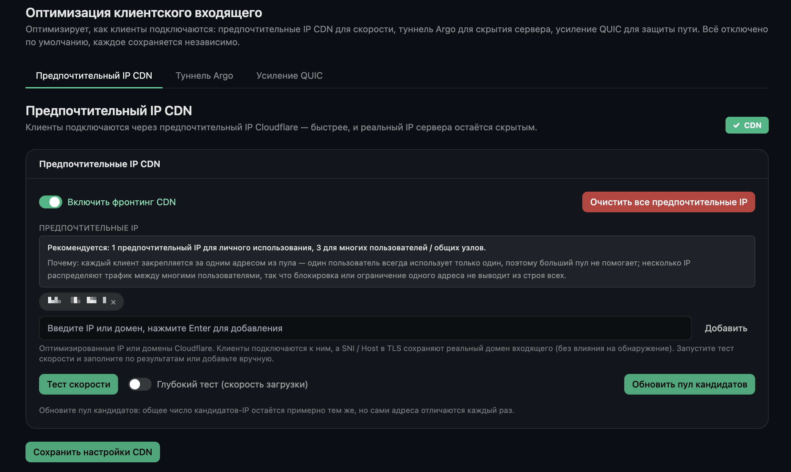
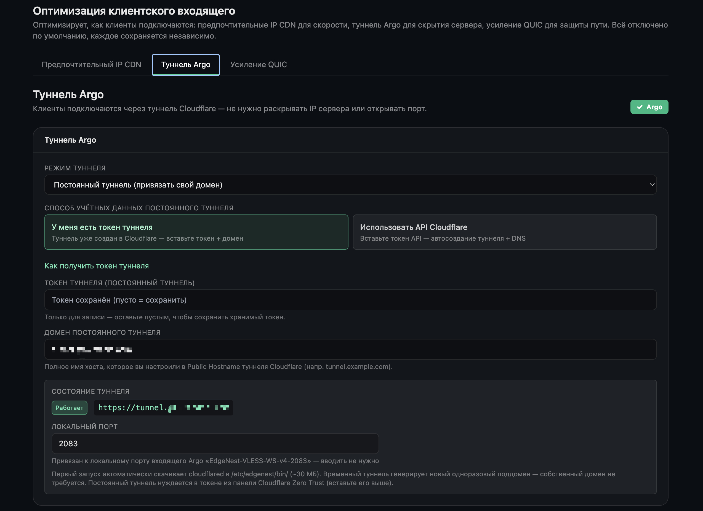

# EdgeNest

**[English](README.md) · [简体中文](README_ZH.md) · [繁體中文](README_ZH-TW.md) · [فارسی](README_FA.md) · [Русский](README_RU.md) · [Tiếng Việt](README_VI.md)**

> Самостоятельно размещаемая панель управления прокси-узлом — два движка, мастер настройки, развёртывание одной командой.

[](./LICENSE)


EdgeNest помогает пользователям в сетях с ограничениями стабильно получать доступ к ИИ-инструментам, технической документации и учебным ресурсам. Одна команда поднимает на вашем собственном VPS панель, раздачу подписок и прокси-движки, объединяя управление многопротокольными входящими подключениями, квотами трафика, сертификатами и оптимизацией исходящего трафика в одном месте — полностью через графический интерфейс, без ручного редактирования конфигов.

---

## Скриншоты

_Панель доступна на 6 языках — переключите язык README выше, чтобы увидеть скриншоты на нужном языке._

**Все 11 входящих протоколов с одного взгляда: популярность, нужен ли домен, поддержка CDN / Argo и устойчивость к помехам сети.**



**Выберите клиентские приложения — EdgeNest настроит каждый вход и сгенерирует готовый к импорту конфиг для каждого клиента.**



**Опциональный CDN-фронт: клиенты подключаются через предпочтительный IP Cloudflare для скорости, реальный IP сервера остаётся скрытым.**



**Опциональный туннель Argo: клиенты подключаются через туннель Cloudflare, без необходимости раскрывать IP сервера или открывать порт.**



---

## Возможности

**Протоколы и движки**
- **11 входящих протоколов** — VLESS-Reality, VLESS-WS, VMess-WS, Trojan-TLS, Hysteria2, TUIC v5, Shadowsocks-2022, AnyTLS, SOCKS5, а также VLESS-XHTTP-Reality / VLESS-XHTTP-TLS на движке Xray
- **Два движка как один** — sing-box и Xray работают бок о бок, так что одна программа покрывает более широкий набор протоколов
- **Создание через мастер** — подбирает набор протоколов по сценарию и по вашему клиенту; дружелюбно к новичкам
- **Тонкая настройка под клиенты** — для 13 популярных клиентов (Shadowrocket, v2rayN, V2RayNG, Hiddify, Stash, Surge, sing-box, Karing, Mihomo Party, Loon, Quantumult X и др.) подписки генерируются в собственном формате каждого клиента и подключаются при импорте, без ручной правки конфигов

**Пользователи и раздача**
- **Многопользовательский режим с квотами трафика** — отдельные учётные данные на пользователя, квоты трафика, сроки действия и сбросы
- **Раздача подписок** — генерация подписок, подключаемых при импорте; QR-коды и обмен в один тап

**Доступ и оптимизация исходящего трафика**
- **Встроенная оптимизация доступа** — предпочтительные IP для CDN, туннели Argo и исходящий WARP — всё настраивается прямо в панели в один тап
- **Маршрутизация по категориям в один клик** — направляйте трафик по категориям (ИИ, стриминг, инструменты разработчика, блокировка рекламы и др.) на WARP / напрямую / блокировку
- **Проверка доступности сервисов** — в один тап проверьте, доступны ли с текущего узла различные стриминговые и ИИ-сервисы
- **Маршрутизация по реальному трафику** — захватывайте реально посещённые домены в реальном времени и генерируйте правила маршрутизации под каждый клиент в один тап

**Эксплуатация и безопасность**
- **Управление сертификатами** — самоподписанные сертификаты работают «из коробки»; при наличии домена можно выпускать сертификаты Let's Encrypt через проверку HTTP или DNS
- **Двойной стек IPv4 / IPv6** — входящие и исходящие в двойном стеке; узлы только с IPv6 тоже работают
- **Telegram-бот управления** — запросы, управление и оповещения прямо из чата
- **Резервное копирование и восстановление** — база данных и сертификаты упаковываются вместе, с шифрованными резервными копиями
- **Приватность и безопасность** — отдельные учётные данные на пользователя, фаервол открывает только реально используемые порты, самоподписанный Hysteria2 закреплён по отпечатку сертификата против MITM, а логи могут маскировать IP клиентов
- **Установка и удаление одной командой** — развёртывание одной командой; удаление не оставляет следов

---

## Быстрый старт

Два способа установки — выберите любой. Сразу после установки запишите выведенные учётные данные и смените пароль при первом входе.

**Требования:** свежий 64-битный Linux VPS (Debian / Ubuntu и др. — см. «Поддерживаемые платформы» ниже) с правами root, рабочим пакетным менеджером и доступом в интернет. Установщик сам поставит все нужные зависимости (curl, git, sqlite3, iptables и …) и предпочитает готовые бинарники — поэтому VPS с **1 ядром / 1 ГБ (даже 512 МБ) устанавливается без какой-либо компиляции**. На сверхминимальных образах без `curl` и даже `sudo` просто запустите установщик от `root` — он подтянет всё необходимое.

### Способ A: git clone (рекомендуется, отслеживает последний релиз)

```bash
# Новым серверам без git его нужно поставить (для клонирования):
#   Debian / Ubuntu:  sudo apt-get update && sudo apt-get install -y git
#   Семейство RHEL:   sudo dnf install -y git
git clone https://github.com/aipo-lenshow/EdgeNest.git
cd EdgeNest
sudo bash scripts/install.sh
```

По умолчанию установщик скачивает готовый артефакт из GitHub Release, при его отсутствии переходя к сборке из исходников.

### Способ B: установка из Release-архива (без git, без компиляции)

В архиве уже лежат бинарники `edgenest` и `sing-box`, которые установщик использует напрямую — пропуская и скачивание, и компиляцию на хосте. Удобно для машин с малым объёмом памяти или офлайн-раздачи.

```bash
VER=1.20.0626
ARCH=amd64   # на машинах ARM64 используйте arm64
curl -fsSL -O https://github.com/aipo-lenshow/EdgeNest/releases/download/v${VER}/edgenest-${VER}-linux-${ARCH}.tar.gz
tar -xzf edgenest-${VER}-linux-${ARCH}.tar.gz
cd edgenest-${VER}-linux-${ARCH}
sudo bash scripts/install.sh
```

### Что делает установщик

1. Даёт выбрать язык панели, затем спрашивает адрес доступа, порт панели и нужно ли добавить движок Xray
2. Устанавливает системные зависимости и разворачивает sing-box (собранный самостоятельно со статистикой трафика) плюс опциональный движок Xray
3. Создаёт systemd-юнит `edgenest.service`, открывает только реально используемые порты и сохраняет правила фаервола
4. Включает управление перегрузкой BBR + fq (`--no-bbr` чтобы пропустить)
5. Выводит URL панели, начальное имя пользователя (`EdgeNest`) и случайный пароль

Для автоматической установки используйте `sudo bash scripts/install.sh --yes` (все значения по умолчанию); для удаления запустите `sudo bash scripts/uninstall.sh` — он полностью очищает систему и по умолчанию сохраняет ваши данные.

### Управление с сервера

После установки в любой момент запустите на сервере **`edgenest`** — откроется меню управления: посмотреть URL панели и учётную запись администратора, перезапустить / остановить / запустить службу, смотреть живые логи, сбросить пароль администратора, обновить до последней стабильной версии и удалить. Это самый быстрый способ снова найти URL панели, если вы его не сохранили.

---

## Поддерживаемые системы

| Категория | Поддержка |
|---|---|
| Дистрибутивы | Debian · Ubuntu · CentOS · AlmaLinux · Rocky · Fedora |
| Архитектуры | x86_64 (amd64) · ARM64 (aarch64) |
| Привилегии | root |

---

## Поддерживаемые протоколы

| Движок | Входящие протоколы |
|---|---|
| sing-box (по умолчанию) | VLESS-Reality · VLESS-WS · VMess-WS · Trojan-TLS · Hysteria2 · TUIC v5 · Shadowsocks-2022 · AnyTLS · SOCKS5 |
| Xray (опционально) | VLESS-XHTTP-Reality · VLESS-XHTTP-TLS |

Каждое входящее подключение настраивает собственный порт, транспорт и источник TLS-сертификата (встроенный самоподписанный или автоматический выпуск через ACME). Протоколы с транспортами WebSocket / XHTTP можно дополнить доступом через CDN и туннели Argo. Движок Xray — опциональная установка; без него панель предлагает только протоколы sing-box.

---

## Языки панели

Панель поставляется с 6 языками интерфейса, выбираемыми при установке и переключаемыми в любой момент в настройках после входа:

English · 简体中文 · 繁體中文 · فارسی (RTL) · Русский · Tiếng Việt

---

## Переменные окружения

`install.sh` учитывает следующие переменные окружения для переопределения поведения по умолчанию (также доступны флаги `--lang=` / `--yes` / `--no-bbr` / `--no-prebuilt`):

| Переменная | По умолчанию | Назначение |
|---|---|---|
| `EDGENEST_LANG` | определяется по `$LANG` | Язык панели и установщика (`en` / `zh` / `zh-TW` / `fa` / `ru` / `vi`) |
| `EDGENEST_VERSION` | `1.20.0626` | Версия для скачивания готового артефакта |
| `EDGENEST_RELEASE_BASE` | база загрузки GitHub Release | Базовый URL для готовых артефактов |
| `SINGBOX_VERSION` | `1.13.13` | Версия sing-box (всегда собирается с тегом статистики `with_v2ray_api`) |
| `XRAY_VERSION` | `26.3.27` | Версия Xray (опционально) |
| `GO_VERSION` | `1.26.0` | Используется, когда нужна сборка из исходников и Go отсутствует |
| `NODE_MAJOR` | `20` | Используется, когда нужна сборка фронтенда из исходников и Node отсутствует |

---

## Сборка из исходников

```bash
make web      # собрать фронтенд и встроить его в бинарник
make build    # единый бинарник (фронтенд встроен)
./bin/edgenest --role standalone
```

Требования для сборки: Go 1.26+, Node 20+. `make release` кросс-компилирует linux/amd64 + linux/arm64 и создаёт tar.gz + SHA256SUMS. Прокси-движок sing-box собирается самостоятельно с тегом статистики трафика через `scripts/build-singbox.sh`; установщик собирает его на месте, когда готового артефакта нет.

---

## Благодарности

EdgeNest стоит на этих замечательных проектах с открытым исходным кодом:

- [sing-box](https://github.com/SagerNet/sing-box) — основной прокси-движок
- [Xray-core](https://github.com/XTLS/Xray-core) — опциональный движок (VLESS-XHTTP)
- [utls](https://github.com/refraction-networking/utls) — имитация TLS-отпечатка
- [wireguard-go](https://github.com/WireGuard/wireguard-go) — основа исходящего WARP
- [lego](https://github.com/go-acme/lego) — выпуск ACME-сертификатов
- [cloudflared](https://github.com/cloudflare/cloudflared) — туннели Argo

---

## Лицензия

[AGPL-3.0](./LICENSE).
