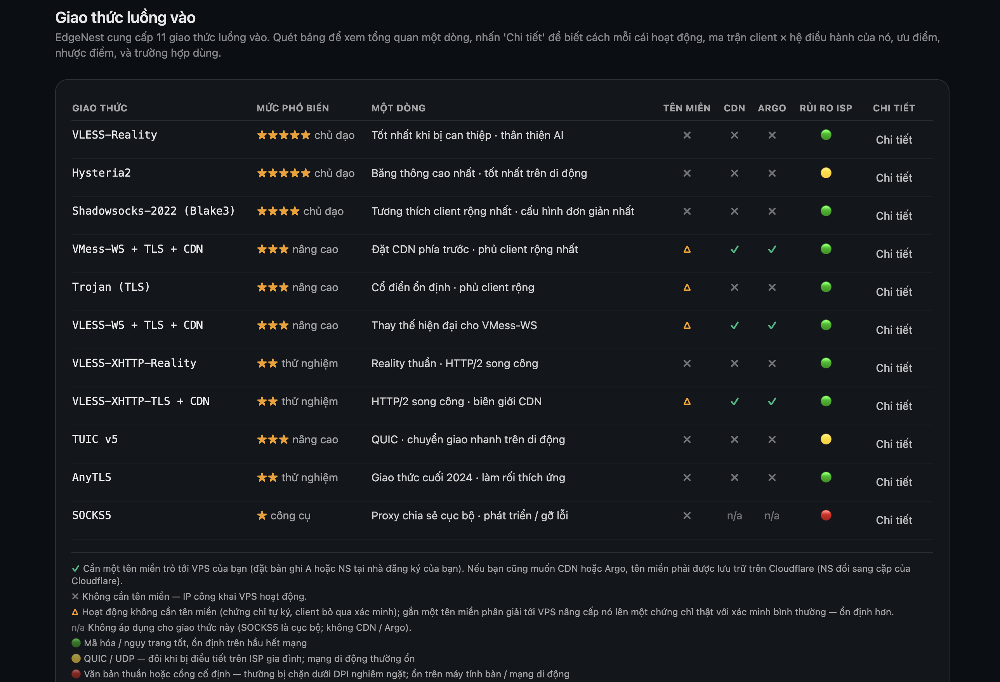
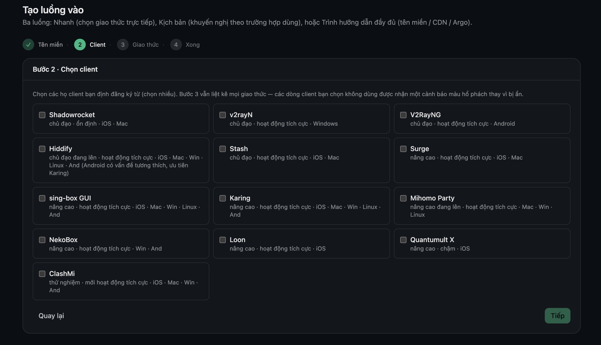
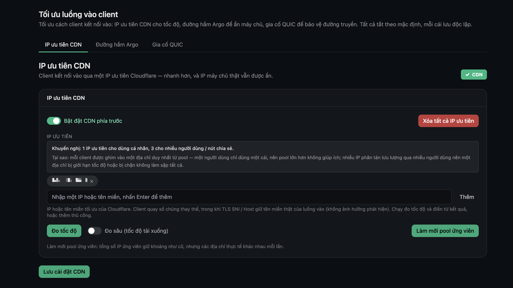
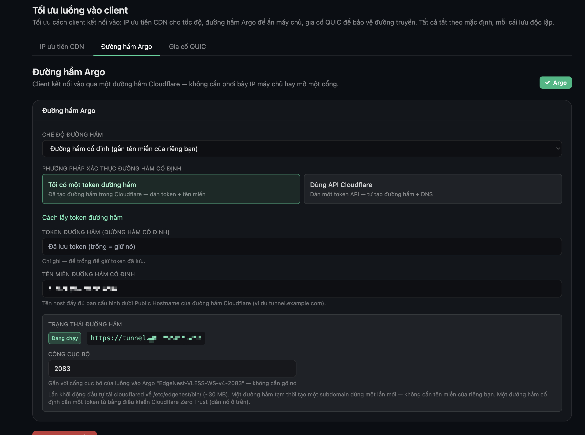

# EdgeNest

**[English](README.md) · [简体中文](README_ZH.md) · [繁體中文](README_ZH-TW.md) · [فارسی](README_FA.md) · [Русский](README_RU.md) · [Tiếng Việt](README_VI.md)**

> Bảng điều khiển quản lý node proxy tự lưu trữ — hai engine, theo trình hướng dẫn, triển khai bằng một lệnh.

[](./LICENSE)


EdgeNest giúp người dùng trong môi trường mạng bị hạn chế truy cập ổn định các công cụ AI, tài liệu kỹ thuật và tài nguyên học tập. Chỉ một lệnh là dựng xong bảng điều khiển, phát hành subscription và các engine proxy trên VPS của bạn — quản lý inbound đa giao thức, hạn mức lưu lượng, chứng chỉ và tối ưu outbound ở cùng một nơi, tất cả qua giao diện đồ họa, không cần sửa file cấu hình bằng tay.

---

## Ảnh chụp màn hình

_Bảng điều khiển có 6 ngôn ngữ — đổi ngôn ngữ README ở trên để xem ảnh chụp tương ứng._

**Toàn bộ 11 giao thức inbound trong một bảng — mức phổ biến, có cần tên miền không, hỗ trợ CDN / Argo và khả năng chống nhiễu mạng.**



**Chọn các ứng dụng client bạn sẽ dùng — EdgeNest tùy biến từng inbound và tạo cấu hình sẵn-sàng-nhập cho mỗi client.**



**CDN front tùy chọn — client kết nối qua IP ưu tiên của Cloudflare để nhanh hơn, còn IP thật của máy chủ vẫn được ẩn.**



**Tunnel Argo tùy chọn — client kết nối qua tunnel Cloudflare, không cần lộ IP máy chủ hay mở cổng.**



---

## Tính năng

**Giao thức & engine**
- **11 giao thức inbound** — VLESS-Reality, VLESS-WS, VMess-WS, Trojan-TLS, Hysteria2, TUIC v5, Shadowsocks-2022, AnyTLS, SOCKS5, cùng VLESS-XHTTP-Reality / VLESS-XHTTP-TLS trên engine Xray
- **Hai engine trong một** — sing-box và Xray chạy song song, nên một chương trình bao phủ nhiều giao thức hơn
- **Tạo theo trình hướng dẫn** — gợi ý bộ giao thức theo tình huống sử dụng và theo client của bạn; thân thiện với người mới
- **Tinh chỉnh sâu theo client** — cho 13 client phổ biến (Shadowrocket, v2rayN, V2RayNG, Hiddify, Stash, Surge, sing-box, Karing, Mihomo Party, Loon, Quantumult X, …), subscription được tạo theo đúng định dạng của từng client và kết nối ngay khi nhập, không cần sửa cấu hình thủ công

**Người dùng & phân phối**
- **Đa người dùng với hạn mức lưu lượng** — thông tin đăng nhập riêng cho mỗi người dùng, kèm hạn mức lưu lượng, ngày hết hạn và đặt lại
- **Phân phối subscription** — tạo subscription kết nối ngay khi nhập; kèm mã QR và chia sẻ một chạm

**Tối ưu truy cập & outbound**
- **Tối ưu truy cập tích hợp sẵn** — IP ưu tiên CDN, tunnel Argo và outbound WARP, đều cấu hình ngay trong bảng điều khiển chỉ một chạm
- **Định tuyến theo danh mục một chạm** — định tuyến lưu lượng theo danh mục (AI, streaming, công cụ lập trình, chặn quảng cáo, …) tới WARP / trực tiếp / chặn
- **Kiểm tra khả năng truy cập dịch vụ** — chỉ một chạm để kiểm tra node hiện tại có truy cập được các dịch vụ streaming và AI khác nhau không
- **Định tuyến từ lưu lượng thực** — bắt các tên miền bạn thực sự truy cập theo thời gian thực và tạo quy tắc định tuyến cho mỗi client chỉ một chạm

**Vận hành & bảo mật**
- **Quản lý chứng chỉ** — chứng chỉ tự ký dùng được ngay; có tên miền thì cấp chứng chỉ Let's Encrypt qua xác thực HTTP hoặc DNS
- **Dual-stack IPv4 / IPv6** — inbound và outbound dual-stack; node chỉ-IPv6 cũng hoạt động tốt
- **Bot quản lý Telegram** — truy vấn, quản lý và nhận cảnh báo, tất cả ngay trong khung chat
- **Sao lưu và khôi phục** — cơ sở dữ liệu và chứng chỉ đóng gói cùng nhau, bản sao lưu được mã hóa
- **Riêng tư và bảo mật** — thông tin đăng nhập riêng cho mỗi người dùng, tường lửa chỉ mở những cổng thực sự dùng, Hysteria2 tự ký được ghim theo dấu vân tay chứng chỉ để chống MITM, và log có thể che IP của client
- **Cài và gỡ bằng một lệnh** — triển khai trong một lệnh; gỡ cài đặt không để lại gì

---

## Bắt đầu nhanh

Hai cách cài đặt — chọn một. Ngay sau khi cài, hãy ghi lại thông tin đăng nhập được in ra và đổi mật khẩu ở lần đăng nhập đầu tiên.

**Yêu cầu:** một VPS Linux 64-bit mới (Debian / Ubuntu, v.v. — xem «Nền tảng được hỗ trợ» bên dưới) với quyền root, trình quản lý gói hoạt động và có internet. Trình cài đặt tự cài mọi thứ cần thiết (curl, git, sqlite3, iptables, …) và ưu tiên dùng binary dựng sẵn — nên một VPS **1 nhân / 1 GB (thậm chí 512 MB) cài được mà không phải biên dịch gì**. Trên các image siêu tối giản thiếu cả `curl` lẫn `sudo`, chỉ cần chạy trình cài đặt bằng `root` — nó sẽ tự kéo về những gì cần.

### Cách A: git clone (khuyến nghị, bám theo bản phát hành mới nhất)

```bash
# Máy chủ mới chưa có git thì cài trước (clone cần nó):
#   Debian / Ubuntu:  sudo apt-get update && sudo apt-get install -y git
#   Họ RHEL:          sudo dnf install -y git
git clone https://github.com/aipo-lenshow/EdgeNest.git
cd EdgeNest
sudo bash scripts/install.sh
```

Mặc định, trình cài đặt tải binary dựng sẵn từ GitHub Release, và quay về dựng từ mã nguồn nếu không có.

### Cách B: cài từ Release tarball (không git, không biên dịch)

Tarball đã kèm sẵn binary `edgenest` và `sing-box` để trình cài đặt dùng trực tiếp — bỏ qua cả việc tải lẫn biên dịch trên máy. Tiện cho máy ít bộ nhớ hoặc phân phối ngoại tuyến.

```bash
VER=1.20.0626
ARCH=amd64   # dùng arm64 trên máy ARM64
curl -fsSL -O https://github.com/aipo-lenshow/EdgeNest/releases/download/v${VER}/edgenest-${VER}-linux-${ARCH}.tar.gz
tar -xzf edgenest-${VER}-linux-${ARCH}.tar.gz
cd edgenest-${VER}-linux-${ARCH}
sudo bash scripts/install.sh
```

### Trình cài đặt làm gì

1. Cho chọn ngôn ngữ bảng điều khiển, rồi hỏi địa chỉ truy cập, cổng bảng điều khiển và có thêm engine Xray hay không
2. Cài các phụ thuộc hệ thống và chuẩn bị sing-box (tự dựng kèm thống kê lưu lượng) cùng engine Xray tùy chọn
3. Tạo systemd unit `edgenest.service`, chỉ mở những cổng thực sự dùng và lưu cố định quy tắc tường lửa
4. Bật kiểm soát tắc nghẽn BBR + fq (`--no-bbr` để bỏ qua)
5. In ra URL bảng điều khiển, tên đăng nhập ban đầu (`EdgeNest`) và mật khẩu ngẫu nhiên

Cài tự động dùng `sudo bash scripts/install.sh --yes` (mọi giá trị mặc định); để gỡ, chạy `sudo bash scripts/uninstall.sh` — dọn sạch hoàn toàn và mặc định giữ lại dữ liệu của bạn.

### Quản lý ngay trên máy chủ

Sau khi cài, chạy **`edgenest`** trên máy chủ bất cứ lúc nào để mở menu quản lý — xem URL bảng điều khiển và tài khoản quản trị, khởi động lại / dừng / chạy dịch vụ, xem log trực tiếp, đặt lại mật khẩu quản trị, nâng cấp lên bản ổn định mới nhất và gỡ cài đặt. Đây là cách nhanh nhất để tìm lại URL bảng điều khiển nếu bạn chưa lưu dấu trang.

---

## Nền tảng được hỗ trợ

| Hạng mục | Hỗ trợ |
|---|---|
| Bản phân phối | Debian · Ubuntu · CentOS · AlmaLinux · Rocky · Fedora |
| Kiến trúc | x86_64 (amd64) · ARM64 (aarch64) |
| Quyền | root |

---

## Giao thức được hỗ trợ

| Engine | Giao thức inbound |
|---|---|
| sing-box (mặc định) | VLESS-Reality · VLESS-WS · VMess-WS · Trojan-TLS · Hysteria2 · TUIC v5 · Shadowsocks-2022 · AnyTLS · SOCKS5 |
| Xray (tùy chọn) | VLESS-XHTTP-Reality · VLESS-XHTTP-TLS |

Mỗi inbound tự cấu hình cổng, transport và nguồn chứng chỉ TLS riêng (tự ký tích hợp sẵn hoặc cấp ACME tự động). Các giao thức dùng transport WebSocket / XHTTP có thể bổ sung truy cập qua CDN và tunnel Argo. Engine Xray là phần cài thêm tùy chọn; nếu không có, bảng điều khiển chỉ cung cấp các giao thức của sing-box.

---

## Ngôn ngữ bảng điều khiển

Bảng điều khiển đi kèm 6 ngôn ngữ giao diện, chọn khi cài đặt và có thể đổi bất cứ lúc nào trong phần cài đặt sau khi đăng nhập:

English · 简体中文 · 繁體中文 · فارسی (RTL) · Русский · Tiếng Việt

---

## Biến môi trường

`install.sh` đọc các biến môi trường sau để ghi đè hành vi mặc định (cũng có các cờ dòng lệnh `--lang=` / `--yes` / `--no-bbr` / `--no-prebuilt`):

| Biến | Mặc định | Mục đích |
|---|---|---|
| `EDGENEST_LANG` | nhận diện từ `$LANG` | Ngôn ngữ bảng điều khiển và trình cài đặt (`en` / `zh` / `zh-TW` / `fa` / `ru` / `vi`) |
| `EDGENEST_VERSION` | `1.20.0626` | Phiên bản dùng khi tải binary dựng sẵn |
| `EDGENEST_RELEASE_BASE` | nguồn tải GitHub Release | URL gốc cho các binary dựng sẵn |
| `SINGBOX_VERSION` | `1.13.13` | Phiên bản sing-box (luôn dựng kèm tag thống kê lưu lượng `with_v2ray_api`) |
| `XRAY_VERSION` | `26.3.27` | Phiên bản Xray (tùy chọn) |
| `GO_VERSION` | `1.26.0` | Dùng khi cần dựng từ mã nguồn và chưa có Go |
| `NODE_MAJOR` | `20` | Dùng khi cần dựng frontend từ mã nguồn và chưa có Node |

---

## Build từ mã nguồn

```bash
make web      # dựng frontend và nhúng vào binary
make build    # một binary duy nhất (đã nhúng frontend)
./bin/edgenest --role standalone
```

Yêu cầu build: Go 1.26+, Node 20+. `make release` biên dịch chéo cho linux/amd64 + linux/arm64 và tạo tar.gz + SHA256SUMS. Engine proxy sing-box được tự dựng kèm tag thống kê lưu lượng qua `scripts/build-singbox.sh`; trình cài đặt sẽ dựng tại chỗ khi không có binary dựng sẵn.

---

## Lời cảm ơn

EdgeNest đứng trên vai những dự án mã nguồn mở tuyệt vời này:

- [sing-box](https://github.com/SagerNet/sing-box) — engine proxy lõi
- [Xray-core](https://github.com/XTLS/Xray-core) — engine tùy chọn (VLESS-XHTTP)
- [utls](https://github.com/refraction-networking/utls) — mô phỏng dấu vân tay TLS
- [wireguard-go](https://github.com/WireGuard/wireguard-go) — nền tảng outbound WARP
- [lego](https://github.com/go-acme/lego) — cấp chứng chỉ ACME
- [cloudflared](https://github.com/cloudflare/cloudflared) — tunnel Argo

---

## Giấy phép

[AGPL-3.0](./LICENSE).
