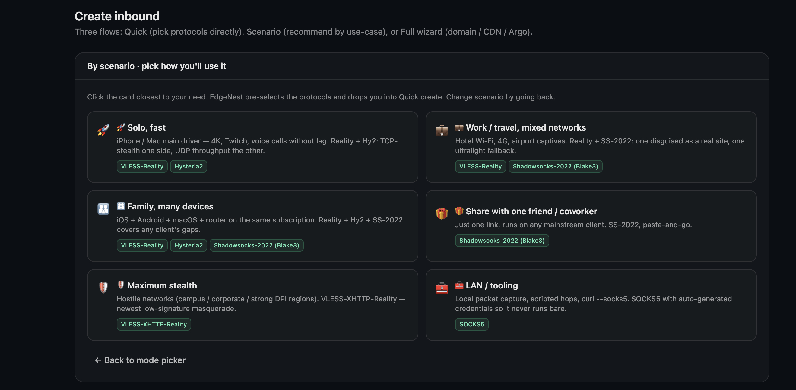
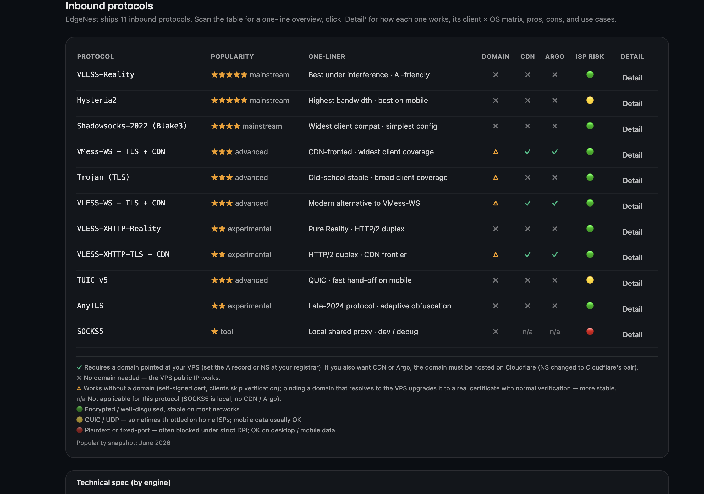
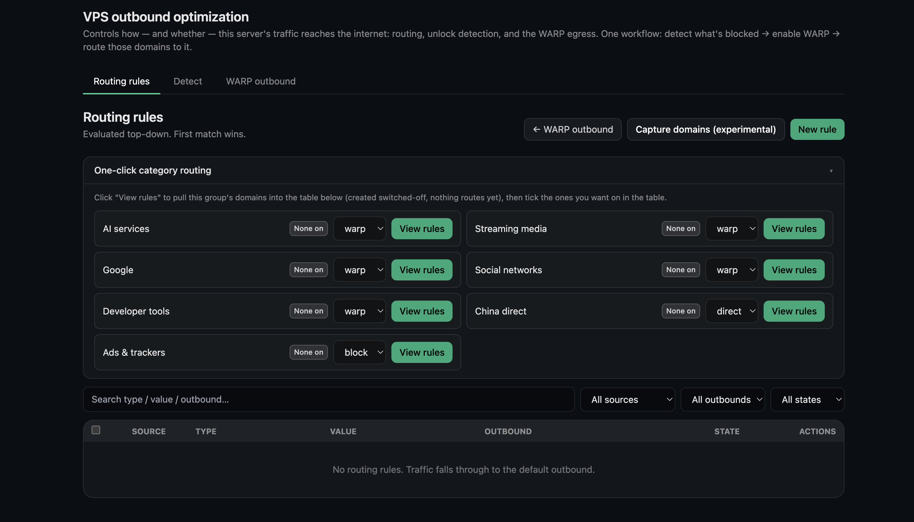
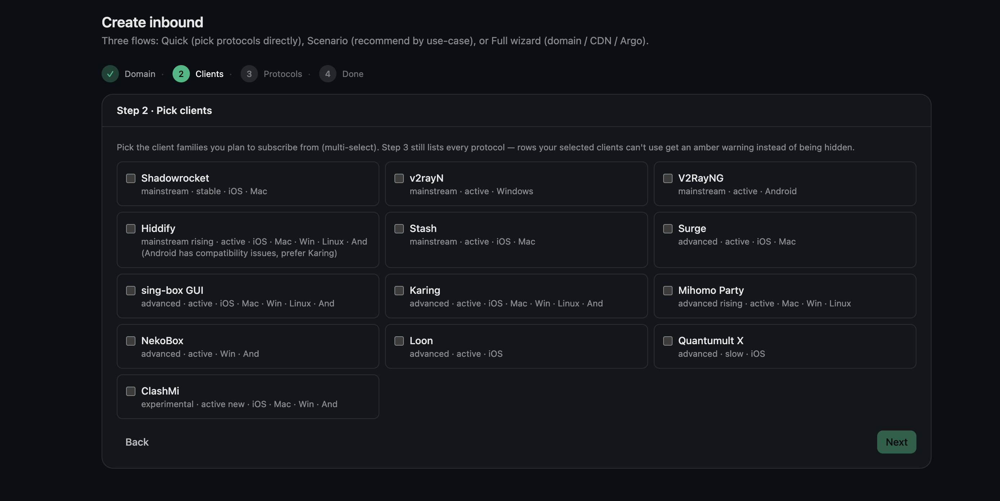

# EdgeNest

**[English](README.md) · [简体中文](README_ZH.md) · [繁體中文](README_ZH-TW.md) · [فارسی](README_FA.md) · [Русский](README_RU.md)**

> 自部署的代理節點管理面板 —— 雙引擎、嚮導式、一鍵部署。

[](./LICENSE)


EdgeNest 幫助在網路受限環境中的使用者穩定存取 AI 工具、技術文件與學習資源。一條命令在你自己的 VPS 上把面板、訂閱分發與協議引擎全部跑起來，統一管理多協議入站、流量配額、憑證與出站最佳化，全程圖形介面，無需手改設定檔。

---

## 介面預覽

**嚮導式建立：依使用情境推薦協議組合，預選後進入快速建立。**



**11 種入站協議一覽：流行度、是否需要網域、CDN / Argo 支援與網路適應性一目了然。**



**一鍵分類路由：依服務類別（AI / 串流 / 開發工具 等）設定出站走向。**



**依用戶端產生訂閱：選擇你要訂閱的用戶端，依各用戶端自有格式產生，匯入即連。**



---

## 功能特性

**協議與引擎**
- **11 種入站協議** —— VLESS-Reality、VLESS-WS、VMess-WS、Trojan-TLS、Hysteria2、TUIC v5、Shadowsocks-2022、AnyTLS、SOCKS5，以及 Xray 引擎的 VLESS-XHTTP-Reality / VLESS-XHTTP-TLS
- **雙引擎合一** —— sing-box 與 Xray 雙引擎同時託管，一個程式涵蓋更廣的協議
- **嚮導式建立** —— 依使用情境和你的用戶端推薦協議組合，新手友善
- **深度用戶端適配** —— 針對 13 個主流用戶端（Shadowrocket、v2rayN、V2RayNG、Hiddify、Stash、Surge、sing-box、Karing、Mihomo Party、Loon、Quantumult X 等）分別依其自有格式產生訂閱，匯入即連，無需手動改設定

**使用者與分發**
- **多使用者與流量配額** —— 每個使用者獨立憑據，支援流量配額、到期時間與重設
- **訂閱分發** —— 為用戶端產生訂閱，匯入即連；支援 QR code 與一鍵分享

**接入與出站最佳化**
- **接入最佳化一體化** —— CDN 優選 IP、Argo 隧道、WARP 出站都在面板內一鍵設定
- **一鍵分類路由** —— 依 AI、串流、開發工具、廣告攔截等類別設定出站走向（走 WARP / 直連 / 攔截）
- **服務可用性偵測** —— 一鍵偵測目前節點能否正常存取各類串流與 AI 服務
- **依真實流量建分流** —— 即時擷取存取過的網域，一鍵產生各用戶端的分流規則

**運維與安全**
- **憑證管理** —— 自簽憑證開箱即用；有網域可簽發 Let's Encrypt 憑證，支援 HTTP 與 DNS 兩種驗證
- **IPv4 / IPv6 雙堆疊** —— 雙堆疊入站與出站，純 IPv6 節點也能正常運作
- **Telegram 管理機器人** —— 查詢、管理與告警都能完成
- **備份與還原** —— 資料庫與憑證一併打包，支援加密備份
- **隱私與安全** —— 每使用者獨立憑據、防火牆只開放實際用到的連接埠、自簽 Hysteria2 以憑證指紋防中間人、日誌可脫敏用戶端 IP
- **一鍵安裝與解除安裝** —— 單條命令完成部署；解除安裝乾淨，不留殘留

---

## 快速開始

兩種安裝方式，任選其一。裝好後請立即記下列印出的憑據並登入改密。

### 方法 A：git clone（推薦，跟隨最新發布）

```bash
# 全新伺服器若沒有 git,先裝上(複製需要它):
#   Debian / Ubuntu:  sudo apt-get update && sudo apt-get install -y git
#   RHEL 系:          sudo dnf install -y git
git clone https://github.com/aipo-lenshow/EdgeNest.git
cd EdgeNest
sudo bash scripts/install.sh
```

安裝指令碼預設從 GitHub Release 下載預編譯產物；不可用時自動回退到原始碼建置。

### 方法 B：下載 Release tarball 直裝（免 git、免編譯）

包內已自帶 `edgenest` 與 `sing-box` 二進位檔，安裝指令碼會直接複用，跳過下載與現場編譯，適合小記憶體機器或離線分發。

```bash
VER=1.12.0624
ARCH=amd64   # ARM64 機器改成 arm64
curl -fsSL -O https://github.com/aipo-lenshow/EdgeNest/releases/download/v${VER}/edgenest-${VER}-linux-${ARCH}.tar.gz
tar -xzf edgenest-${VER}-linux-${ARCH}.tar.gz
cd edgenest-${VER}-linux-${ARCH}
sudo bash scripts/install.sh
```

### 安裝指令碼會做什麼

1. 選擇面板語言，再詢問存取位址、面板連接埠與是否加掛 Xray
2. 安裝系統相依套件，就位 sing-box（自編譯帶流量統計）與可選的 Xray 引擎
3. 建立 systemd 服務 `edgenest.service`，只放行實際用到的連接埠並持久化防火牆規則
4. 啟用 BBR + fq 壅塞控制（`--no-bbr` 可跳過）
5. 列印面板位址、初始使用者名稱（`EdgeNest`）與隨機密碼

非互動安裝用 `sudo bash scripts/install.sh --yes`（全部取預設值）；解除安裝用 `sudo bash scripts/uninstall.sh`，清理乾淨，預設保留資料。

---

## 支援的系統

| 類別 | 支援 |
|---|---|
| 發行版 | Debian · Ubuntu · CentOS · AlmaLinux · Rocky · Fedora |
| 架構 | x86_64（amd64）· ARM64（aarch64） |
| 權限 | root |

---

## 支援的協議

| 引擎 | 入站協議 |
|---|---|
| sing-box（預設） | VLESS-Reality · VLESS-WS · VMess-WS · Trojan-TLS · Hysteria2 · TUIC v5 · Shadowsocks-2022 · AnyTLS · SOCKS5 |
| Xray（可選） | VLESS-XHTTP-Reality · VLESS-XHTTP-TLS |

每個入站獨立設定連接埠、傳輸與 TLS 憑證來源（面板內建自簽或 ACME 自動簽發）。帶 WebSocket / XHTTP 傳輸的協議可疊加 CDN 與 Argo 隧道接入。Xray 引擎為可選安裝，未安裝時面板只提供 sing-box 協議。

---

## 面板語言

面板內建 6 種介面語言，安裝時選擇，登入後也可在設定裡隨時切換：

English · 简体中文 · 繁體中文 · فارسی（RTL）· Русский · Tiếng Việt

---

## 環境變數

`install.sh` 支援以下環境變數覆寫預設行為（也可用 `--lang=` / `--yes` / `--no-bbr` / `--no-prebuilt` 等命令列參數）：

| 變數 | 預設 | 用途 |
|---|---|---|
| `EDGENEST_LANG` | 依 `$LANG` 偵測 | 面板與安裝語言（`en` / `zh` / `zh-TW` / `fa` / `ru` / `vi`） |
| `EDGENEST_VERSION` | `1.12.0624` | 預編譯產物下載版本 |
| `EDGENEST_RELEASE_BASE` | GitHub Release 下載位址 | 預編譯產物的下載基址 |
| `SINGBOX_VERSION` | `1.13.13` | sing-box 版本（始終帶 `with_v2ray_api` 流量統計） |
| `XRAY_VERSION` | `26.3.27` | Xray 版本（選裝） |
| `GO_VERSION` | `1.26.0` | 需原始碼建置且系統無 Go 時使用 |
| `NODE_MAJOR` | `20` | 需前端原始碼建置且系統無 Node 時使用 |

---

## 從原始碼建置

```bash
make web      # 建置前端並內嵌到二進位檔
make build    # 單二進位檔（前端已內嵌）
./bin/edgenest --role standalone
```

建置要求：Go 1.26+、Node 20+。`make release` 交叉編譯 linux/amd64 + linux/arm64 並打 tar.gz + SHA256SUMS。代理引擎 sing-box 由 `scripts/build-singbox.sh` 帶流量統計標籤自編譯，安裝指令碼在沒有預編譯產物時會自動現場建置。

---

## 開源致謝

EdgeNest 站在這些優秀開源專案之上：

- [sing-box](https://github.com/SagerNet/sing-box) —— 核心代理引擎
- [Xray-core](https://github.com/XTLS/Xray-core) —— 可選引擎（VLESS-XHTTP）
- [utls](https://github.com/refraction-networking/utls) —— TLS 指紋模擬
- [wireguard-go](https://github.com/WireGuard/wireguard-go) —— WARP 出站底層
- [lego](https://github.com/go-acme/lego) —— ACME 憑證簽發
- [cloudflared](https://github.com/cloudflare/cloudflared) —— Argo 隧道

---

## 開源協議

[AGPL-3.0](./LICENSE)。
