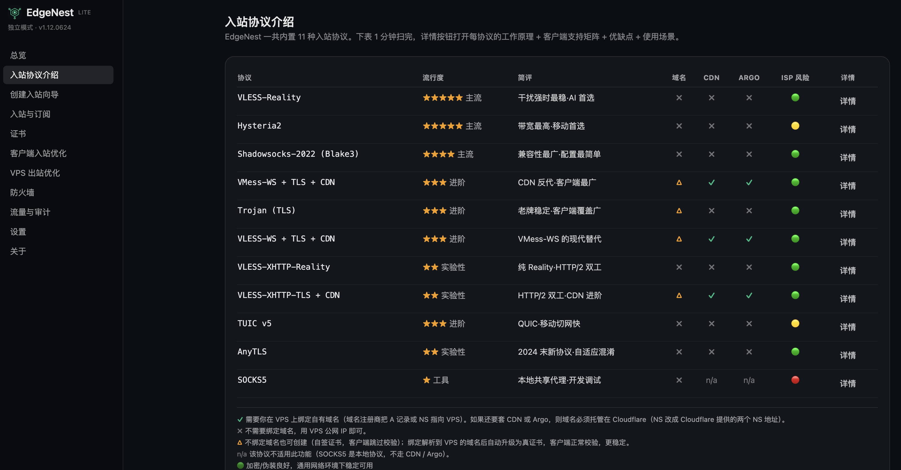
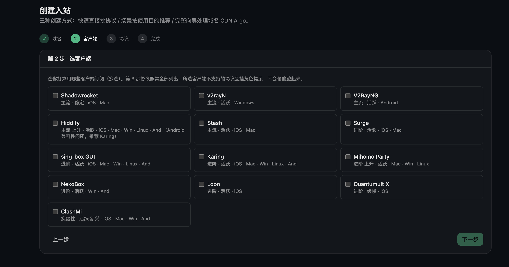
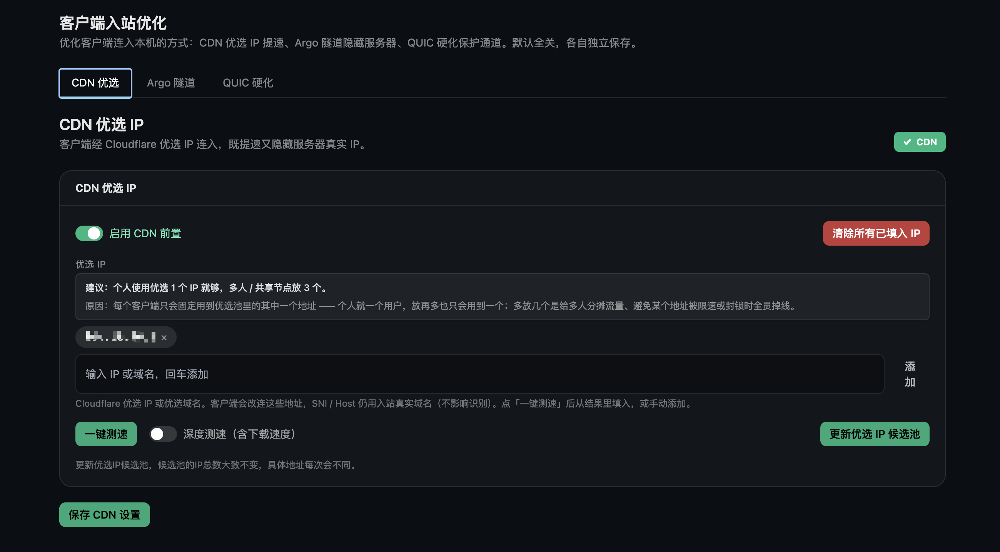
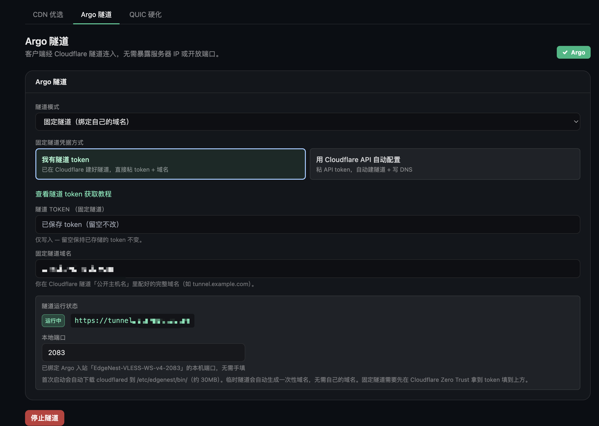

# EdgeNest

**[English](README.md) · [简体中文](README_ZH.md) · [繁體中文](README_ZH-TW.md) · [فارسی](README_FA.md) · [Русский](README_RU.md) · [Tiếng Việt](README_VI.md)**

> 自部署的代理节点管理面板 —— 双引擎、向导式、一键部署。

[](./LICENSE)


EdgeNest 帮助在网络受限环境中的用户稳定访问 AI 工具、技术文档与学习资源。一条命令在你自己的 VPS 上把面板、订阅分发与协议引擎全部跑起来，统一管理多协议入站、流量配额、证书与出站优化，全程图形界面，无需手改配置文件。

---

## 界面预览

_面板支持 6 种语言 —— 用上方语言切换可看到对应语言的截图。_

**11 种入站协议一览：流行度、是否需要域名、CDN / Argo 支持与网络适应性一目了然。**



**勾选你要用的客户端 App，EdgeNest 为每个入站定制并生成可直接导入的配置。**



**可选 CDN 前置：客户端经 Cloudflare 优选 IP 接入更快，真实服务器 IP 不暴露。**



**可选 Argo 隧道：客户端经 Cloudflare 隧道接入，无需暴露服务器 IP、无需开端口。**



---

## 功能特性

**协议与引擎**
- **11 种入站协议** —— VLESS-Reality、VLESS-WS、VMess-WS、Trojan-TLS、Hysteria2、TUIC v5、Shadowsocks-2022、AnyTLS、SOCKS5，以及 Xray 引擎的 VLESS-XHTTP-Reality / VLESS-XHTTP-TLS
- **双引擎合一** —— sing-box 与 Xray 双引擎同时托管，一个程序覆盖更广的协议
- **向导式创建** —— 按使用场景和你的客户端推荐协议组合，新手友好
- **深度客户端适配** —— 针对 13 个主流客户端（Shadowrocket、v2rayN、V2RayNG、Hiddify、Stash、Surge、sing-box、Karing、Mihomo Party、Loon、Quantumult X 等）分别按其自有格式生成订阅，导入即连，无需手动改配置

**用户与分发**
- **多用户与流量配额** —— 每个用户独立凭据，支持流量配额、到期时间与重置
- **订阅分发** —— 为客户端生成订阅，导入即连；支持二维码与一键分享

**接入与出站优化**
- **接入优化一体化** —— CDN 优选 IP、Argo 隧道、WARP 出站都在面板内一键配置
- **一键分类路由** —— 按 AI、流媒体、开发工具、广告拦截等类别设置出站走向（走 WARP / 直连 / 拦截）
- **服务可用性检测** —— 一键检测当前节点能否正常访问各类流媒体与 AI 服务
- **按真实流量建分流** —— 实时捕获访问过的域名，一键生成各客户端的分流规则

**运维与安全**
- **证书管理** —— 自签证书开箱即用；有域名可签发 Let's Encrypt 证书，支持 HTTP 与 DNS 两种验证
- **IPv4 / IPv6 双栈** —— 双栈入站与出站，纯 IPv6 节点也能正常工作
- **Telegram 管理机器人** —— 查询、管理与告警都能完成
- **备份与恢复** —— 数据库与证书一并打包，支持加密备份
- **隐私与安全** —— 每用户独立凭据、防火墙只开放实际用到的端口、自签 Hysteria2 以证书指纹防中间人、日志可脱敏客户端 IP
- **一键安装与卸载** —— 单条命令完成部署；卸载干净，不留残留

---

## 快速开始

两种安装方式，任选其一。装好后请立即记下打印出的凭据并登录改密。

**环境要求**：一台全新的 64 位 Linux VPS（Debian / Ubuntu 等，见下方「支持的平台」），具备 root 权限、可用的包管理器和联网。安装脚本会自动装好所需依赖（curl、git、sqlite3、iptables 等），并优先使用预编译二进制——所以 **1 核 / 1 GB（甚至 512 MB）的 VPS 也无需现场编译即可安装**。极简镜像若连 `curl` 甚至 `sudo` 都没有，直接用 `root` 跑安装脚本即可，它会自行补齐。

### 方法 A：git clone（推荐，跟随最新发布）

```bash
# 全新服务器若没有 git,先装上(克隆需要它):
#   Debian / Ubuntu:  sudo apt-get update && sudo apt-get install -y git
#   RHEL 系:          sudo dnf install -y git
git clone https://github.com/aipo-lenshow/EdgeNest.git
cd EdgeNest
sudo bash scripts/install.sh
```

安装脚本默认从 GitHub Release 下载预编译产物；不可用时自动回退到源码构建。

### 方法 B：下载 Release tarball 直装（免 git、免编译）

包内已自带 `edgenest` 与 `sing-box` 二进制，安装脚本会直接复用，跳过下载与现场编译，适合小内存机器或离线分发。

```bash
VER=1.20.0626
ARCH=amd64   # ARM64 机器改成 arm64
curl -fsSL -O https://github.com/aipo-lenshow/EdgeNest/releases/download/v${VER}/edgenest-${VER}-linux-${ARCH}.tar.gz
tar -xzf edgenest-${VER}-linux-${ARCH}.tar.gz
cd edgenest-${VER}-linux-${ARCH}
sudo bash scripts/install.sh
```

### 安装脚本会做什么

1. 选择面板语言，再询问访问地址、面板端口与是否加挂 Xray
2. 安装系统依赖，就位 sing-box（自编译带流量统计）与可选的 Xray 引擎
3. 创建 systemd 服务 `edgenest.service`，只放行实际用到的端口并持久化防火墙规则
4. 启用 BBR + fq 拥塞控制（`--no-bbr` 可跳过）
5. 打印面板地址、初始用户名（`EdgeNest`）与随机密码

非交互安装用 `sudo bash scripts/install.sh --yes`（全部取默认值）；卸载用 `sudo bash scripts/uninstall.sh`，清理干净，默认保留数据。

### 在服务器上管理

安装后，随时在服务器上运行 **`edgenest`** 即可唤出管理菜单——查看面板地址与管理员账号、重启 / 停止 / 启动服务、查看实时日志、重置管理员密码、升级到最新稳定版、卸载。如果忘了收藏面板地址，这是最快找回的方式。

---

## 支持的系统

| 类别 | 支持 |
|---|---|
| 发行版 | Debian · Ubuntu · CentOS · AlmaLinux · Rocky · Fedora |
| 架构 | x86_64（amd64）· ARM64（aarch64） |
| 权限 | root |

---

## 支持的协议

| 引擎 | 入站协议 |
|---|---|
| sing-box（默认） | VLESS-Reality · VLESS-WS · VMess-WS · Trojan-TLS · Hysteria2 · TUIC v5 · Shadowsocks-2022 · AnyTLS · SOCKS5 |
| Xray（可选） | VLESS-XHTTP-Reality · VLESS-XHTTP-TLS |

每个入站独立配置端口、传输与 TLS 证书来源（面板内置自签或 ACME 自动签发）。带 WebSocket / XHTTP 传输的协议可叠加 CDN 与 Argo 隧道接入。Xray 引擎为可选安装，未安装时面板只提供 sing-box 协议。

---

## 面板语言

面板内置 6 种界面语言，安装时选择，登录后也可在设置里随时切换：

English · 简体中文 · 繁體中文 · فارسی（RTL）· Русский · Tiếng Việt

---

## 环境变量

`install.sh` 支持以下环境变量覆盖默认行为（也可用 `--lang=` / `--yes` / `--no-bbr` / `--no-prebuilt` 等命令行参数）：

| 变量 | 默认 | 用途 |
|---|---|---|
| `EDGENEST_LANG` | 按 `$LANG` 探测 | 面板与安装语言（`en` / `zh` / `zh-TW` / `fa` / `ru` / `vi`） |
| `EDGENEST_VERSION` | `1.20.0626` | 预编译产物下载版本 |
| `EDGENEST_RELEASE_BASE` | GitHub Release 下载地址 | 预编译产物的下载基址 |
| `SINGBOX_VERSION` | `1.13.13` | sing-box 版本（始终带 `with_v2ray_api` 流量统计） |
| `XRAY_VERSION` | `26.3.27` | Xray 版本（选装） |
| `GO_VERSION` | `1.26.0` | 需源码构建且系统无 Go 时使用 |
| `NODE_MAJOR` | `20` | 需前端源码构建且系统无 Node 时使用 |

---

## 从源码构建

```bash
make web      # 构建前端并内嵌到二进制
make build    # 单二进制（前端已内嵌）
./bin/edgenest --role standalone
```

构建要求：Go 1.26+、Node 20+。`make release` 交叉编译 linux/amd64 + linux/arm64 并打 tar.gz + SHA256SUMS。代理引擎 sing-box 由 `scripts/build-singbox.sh` 带流量统计标签自编译，安装脚本在没有预编译产物时会自动现场构建。

---

## 开源致谢

EdgeNest 站在这些优秀开源项目之上：

- [sing-box](https://github.com/SagerNet/sing-box) —— 核心代理引擎
- [Xray-core](https://github.com/XTLS/Xray-core) —— 可选引擎（VLESS-XHTTP）
- [utls](https://github.com/refraction-networking/utls) —— TLS 指纹模拟
- [wireguard-go](https://github.com/WireGuard/wireguard-go) —— WARP 出站底层
- [lego](https://github.com/go-acme/lego) —— ACME 证书签发
- [cloudflared](https://github.com/cloudflare/cloudflared) —— Argo 隧道

---

## 开源协议

[AGPL-3.0](./LICENSE)。
